 

  

<b>Full-Stack Developer · Django · React · API Engineering</b>

---

## Engineering Profile

I build **full-stack web applications with a backend-first mindset**. My main focus is Python, Django and Django REST Framework, while developing modern frontend skills with JavaScript, React and Vite.

I care about the engineering behind a useful application: **API architecture, authentication, database design, asynchronous processing, containerization, maintainability and production-oriented workflows**.

`BUILD` · `APIs` · `AUTH` · `DATA` · `ASYNC` · `FRONTEND` · `CONTAINERS`

---

## Current Focus

<table width="100%" cellspacing="0" cellpadding="14">
<tr>
<td width="33%" valign="top">

### Build

**Ekaton**

My flagship full-stack project, bringing together React/Vite, Django REST, PostgreSQL, Redis, Celery and Docker Compose.

</td>
<td width="33%" valign="top">

### Deepen

**Backend Engineering**

Production API architecture, JWT authentication, permissions, validation, advanced Django ORM patterns and background jobs.

</td>
<td width="34%" valign="top">

### Explore

**AI + Modern Web**

Advanced React concepts, JavaScript, AI-assisted development and emerging developer technologies.

</td>
</tr>
</table>

---

## Ekaton — Flagship Project

<table width="100%" cellspacing="0" cellpadding="14">
<tr>
<td width="64%" valign="top">

<h3>Ekaton</h3>

<b>Production-oriented full-stack application</b>

Ekaton is where I combine frontend, backend, database, asynchronous processing and containerization into one full-stack system.

<code>React</code> <code>Vite</code> <code>JavaScript</code> <code>Django</code> <code>DRF</code> <code>PostgreSQL</code> <code>Redis</code> <code>Celery</code> <code>Docker</code> <code>Docker Compose</code> <code>JWT</code>

</td>
<td width="36%" valign="top">

<pre>
┌──────────────────┐
│   React + Vite   │
└────────┬─────────┘
         │ REST / JWT
         ▼
┌──────────────────┐
│    Django + DRF  │
└──────┬───────┬───┘
       │       │
       ▼       ▼
 PostgreSQL   Redis
                 │
                 ▼
              Celery

      Docker Compose
</pre>

</td>
</tr>
</table>

---

## Languages & Tools

<table>
<tr>
<td align="center" width="112"> <b>Python</b></td>
<td align="center" width="112"> <b>JavaScript</b></td>
<td align="center" width="112"> <b>React</b></td>
<td align="center" width="112"> <b>Django</b></td>
<td align="center" width="112"> <b>Vite</b></td>
<td align="center" width="112"> <b>HTML</b></td>
<td align="center" width="112"> <b>CSS</b></td>
</tr>
<tr>
<td align="center"> <b>PostgreSQL</b></td>
<td align="center"> <b>Redis</b></td>
<td align="center"> <b>Docker</b></td>
<td align="center"> <b>Git</b></td>
<td align="center"> <b>GitHub</b></td>
<td align="center"> <b>VS Code</b></td>
<td align="center"> <b>Postman</b></td>
</tr>
</table>

Backend: Django · DRF · REST APIs · JWT &nbsp;·&nbsp; Data: PostgreSQL · Redis &nbsp;·&nbsp; Async: Celery &nbsp;·&nbsp; DevOps: Docker · Docker Compose

---

## Selected Project Work

<table width="100%" cellspacing="0" cellpadding="14">
<tr>
<td width="55%" valign="top">

### Ekaton

**Flagship full-stack application**

React/Vite frontend + Django REST backend + PostgreSQL + Redis + Celery + Docker Compose.

<a href="https://github.com/nandagopan006">Follow the project on GitHub →</a>

</td>
<td width="45%" valign="top">

### WappiCart

**Modern e-commerce storefront**

A Next.js shoe storefront built around WhatsApp ordering, with product discovery, wishlist functionality, responsive interfaces and motion-driven interaction.

<a href="https://github.com/nandagopan006/WappiCart">View repository →</a>

</td>
</tr>
</table>

---

## Learning Now

<table>
<tr>
<td align="center" width="25%"><b>01</b> JavaScript <small>Modern frontend fundamentals</small></td>
<td align="center" width="25%"><b>02</b> React <small>Advanced concepts & patterns</small></td>
<td align="center" width="25%"><b>03</b> DRF <small>Production API engineering</small></td>
<td align="center" width="25%"><b>04</b> AI <small>Modern developer tooling</small></td>
</tr>
</table>

---

## GitHub Activity

  

  

---

## Contribution Motion

<picture>
  <source media="(prefers-color-scheme: dark)" srcset="https://raw.githubusercontent.com/nandagopan006/nandagopan006/output/github-contribution-grid-snake-dark.svg">
  <source media="(prefers-color-scheme: light)" srcset="https://raw.githubusercontent.com/nandagopan006/nandagopan006/output/github-contribution-grid-snake.svg">
  
</picture>

---

## Connect

  
<code>LinkedIn: [LINKEDIN_URL]</code>
&nbsp;&nbsp;
<code>Portfolio: [PORTFOLIO_URL]</code>

---

 

<b>Build systems. Learn deeply. Ship better.</b>

